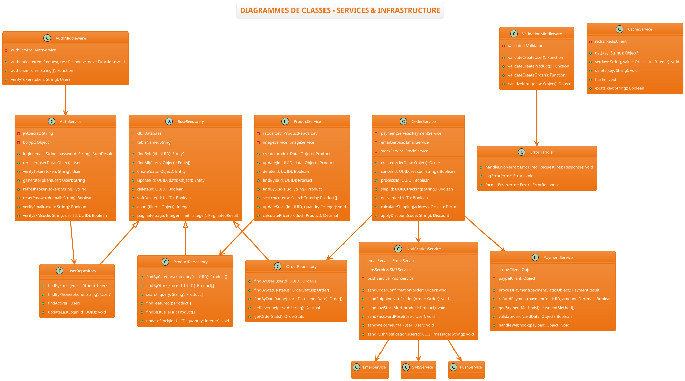
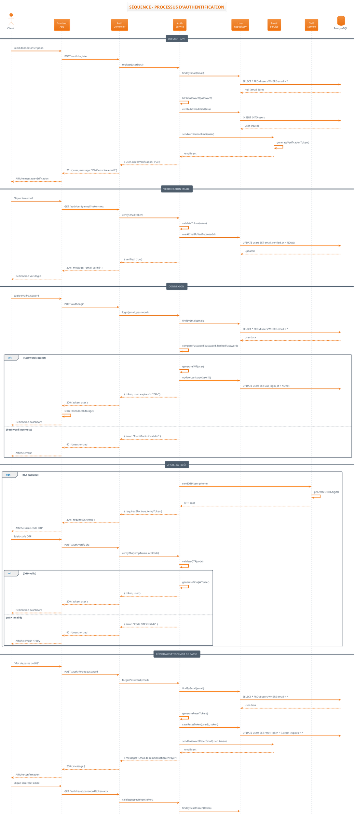
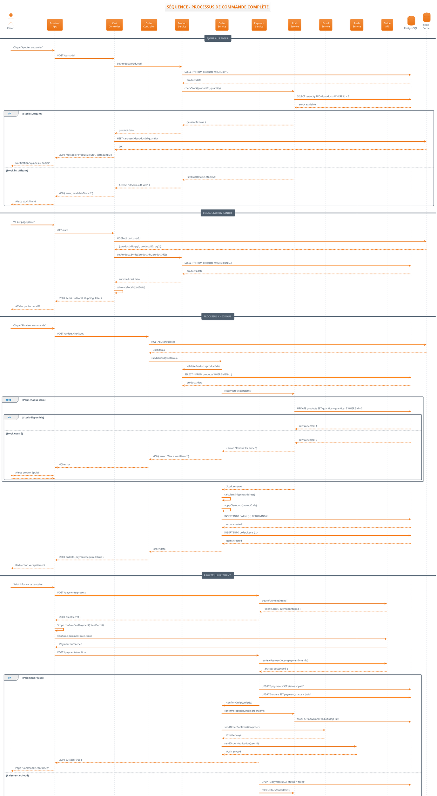
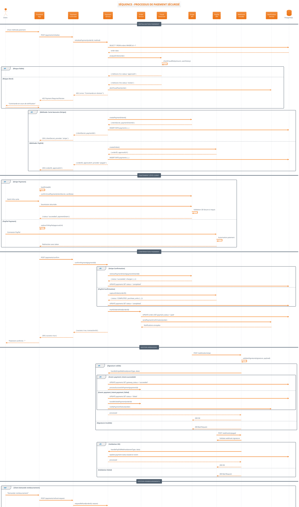
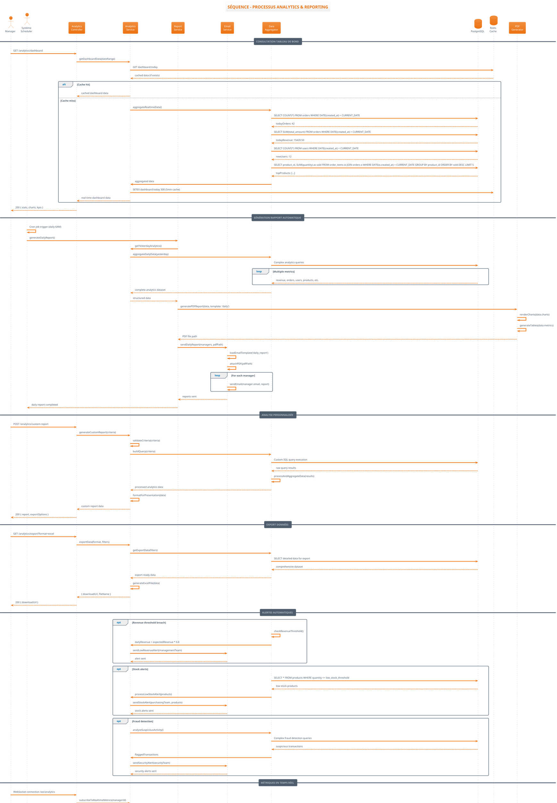
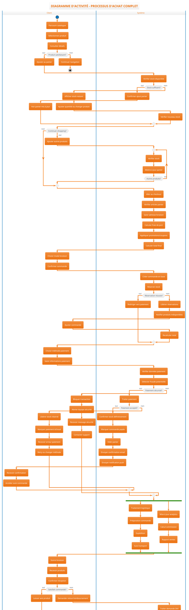

# 🎯 DIAGRAMMES UML COMPLETS - AFRIKMODE

## 📋 TABLE DES MATIÈRES

1. [Diagramme des Cas d'Utilisation](#1-diagramme-des-cas-dutilisation)
2. [Diagrammes de Classes](#2-diagrammes-de-classes)
3. [Diagrammes de Séquence](#3-diagrammes-de-séquence)  
4. [Diagrammes d'Activité](#4-diagrammes-dactivité)
5. [Architecture Système](#5-architecture-système)

---

## 1. DIAGRAMME DES CAS D'UTILISATION

### 🎭 Vue d'Ensemble Globale

```plantuml
@startuml AfrikMode_CasUtilisation_Global
!theme aws-orange
title DIAGRAMME CAS D'UTILISATION - AFRIKMODE E-COMMERCE

' Acteurs
actor "👤 Visiteur" as Visiteur
actor "🛒 Client" as Client
actor "✍️ Éditeur" as Editeur  
actor "👔 Manager" as Manager
actor "⚙️ Administrateur" as Admin
actor "🔧 Super Admin" as SuperAdmin

' Systèmes externes
actor "💳 Système Paiement" as PaymentSystem
actor "📧 Système Email" as EmailSystem
actor "📱 Système SMS" as SMSSystem
actor "🚚 Transporteurs" as ShippingSystem

' Système principal
rectangle "AFRIKMODE SYSTEM" {
  
  ' === SECTION A: CONSULTATION PUBLIQUE ===
  package "A. Consultation Publique" {
    usecase "A1. Consulter catalogue" as UC_A1
    usecase "A2. Rechercher produits" as UC_A2
    usecase "A3. Filtrer/Trier" as UC_A3
    usecase "A4. Voir détail produit" as UC_A4
    usecase "A5. Consulter avis clients" as UC_A5
    usecase "A6. Comparer produits" as UC_A6
    usecase "A7. Voir promotions" as UC_A7
    usecase "A8. S'inscrire newsletter" as UC_A8
  }

  ' === SECTION B: GESTION COMPTE CLIENT ===
  package "B. Gestion Compte Client" {
    usecase "B1. Créer compte" as UC_B1
    usecase "B2. Se connecter" as UC_B2
    usecase "B3. Réinitialiser MDP" as UC_B3
    usecase "B4. Vérifier email/SMS" as UC_B4
    usecase "B5. Gérer profil" as UC_B5
    usecase "B6. Gérer adresses" as UC_B6
    usecase "B7. Voir historique commandes" as UC_B7
    usecase "B8. Gérer liste favoris" as UC_B8
    usecase "B9. Configurer notifications" as UC_B9
    usecase "B10. Supprimer compte" as UC_B10
  }

  ' === SECTION C: PROCESSUS ACHAT ===
  package "C. Processus d'Achat" {
    usecase "C1. Ajouter au panier" as UC_C1
    usecase "C2. Modifier panier" as UC_C2
    usecase "C3. Calculer frais livraison" as UC_C3
    usecase "C4. Appliquer coupon/promo" as UC_C4
    usecase "C5. Choisir mode livraison" as UC_C5
    usecase "C6. Finaliser commande" as UC_C6
    usecase "C7. Effectuer paiement" as UC_C7
    usecase "C8. Confirmer commande" as UC_C8
    usecase "C9. Suivre livraison" as UC_C9
    usecase "C10. Confirmer réception" as UC_C10
  }

  ' === SECTION D: GESTION PRODUITS ===
  package "D. Gestion Produits" {
    usecase "D1. Créer produit" as UC_D1
    usecase "D2. Modifier produit" as UC_D2
    usecase "D3. Supprimer produit" as UC_D3
    usecase "D4. Gérer variantes" as UC_D4
    usecase "D5. Gérer prix/promos" as UC_D5
    usecase "D6. Télécharger images" as UC_D6
    usecase "D7. Gérer SEO produit" as UC_D7
    usecase "D8. Modérer avis" as UC_D8
    usecase "D9. Analyser performance" as UC_D9
    usecase "D10. Import/Export masse" as UC_D10
  }

  ' === SECTION E: GESTION STOCKS ===
  package "E. Gestion Stocks" {
    usecase "E1. Consulter stocks" as UC_E1
    usecase "E2. Ajuster stocks manuellement" as UC_E2
    usecase "E3. Définir seuils d'alerte" as UC_E3
    usecase "E4. Recevoir alertes stock" as UC_E4
    usecase "E5. Gérer réservations" as UC_E5
    usecase "E6. Historique mouvements" as UC_E6
    usecase "E7. Gérer fournisseurs" as UC_E7
    usecase "E8. Passer commandes fournisseur" as UC_E8
    usecase "E9. Recevoir livraisons" as UC_E9
    usecase "E10. Inventaire physique" as UC_E10
  }

  ' === SECTION F: GESTION COMMANDES ===
  package "F. Gestion Commandes" {
    usecase "F1. Consulter commandes" as UC_F1
    usecase "F2. Valider commande" as UC_F2
    usecase "F3. Préparer commande" as UC_F3
    usecase "F4. Expédier commande" as UC_F4
    usecase "F5. Gérer retours/SAV" as UC_F5
    usecase "F6. Rembourser client" as UC_F6
    usecase "F7. Annuler commande" as UC_F7
    usecase "F8. Contacter client" as UC_F8
    usecase "F9. Générer factures" as UC_F9
    usecase "F10. Archiver commandes" as UC_F10
  }

  ' === SECTION H: REPORTING & ANALYTICS ===
  package "H. Reporting & Analytics" {
    usecase "H1. Tableau de bord" as UC_H1
    usecase "H2. Rapports ventes" as UC_H2
    usecase "H3. Analytics clients" as UC_H3
    usecase "H4. Performance produits" as UC_H4
    usecase "H5. Suivi KPI" as UC_H5
    usecase "H6. Rapports financiers" as UC_H6
    usecase "H7. Export données" as UC_H7
    usecase "H8. Rapports automatiques" as UC_H8
    usecase "H9. Alertes business" as UC_H9
    usecase "H10. Analyse prédictive" as UC_H10
  }

  ' === SECTION I: GESTION CONTENU ===
  package "I. Gestion Contenu" {
    usecase "I1. Créer article blog" as UC_I1
    usecase "I2. Publier contenu" as UC_I2
    usecase "I3. Programmer publication" as UC_I3
    usecase "I4. Modérer commentaires" as UC_I4
    usecase "I5. Gérer pages statiques" as UC_I5
    usecase "I6. SEO général" as UC_I6
    usecase "I7. Gérer médias" as UC_I7
    usecase "I8. Newsletter" as UC_I8
    usecase "I9. Campagnes marketing" as UC_I9
    usecase "I10. Réseaux sociaux" as UC_I10
  }

  ' === SECTION J: ADMINISTRATION ===
  package "J. Administration" {
    usecase "J1. Gérer utilisateurs" as UC_J1
    usecase "J2. Gérer rôles/permissions" as UC_J2
    usecase "J3. Configurer système" as UC_J3
    usecase "J4. Gérer catégories" as UC_J4
    usecase "J5. Modérer contenu" as UC_J5
    usecase "J6. Gérer boutiques" as UC_J6
    usecase "J7. Support client" as UC_J7
    usecase "J8. Gérer paiements" as UC_J8
    usecase "J9. Audit système" as UC_J9
    usecase "J10. Notifications masse" as UC_J10
  }

  ' === SECTION K: MAINTENANCE ===
  package "K. Maintenance" {
    usecase "K1. Sauvegarder données" as UC_K1
    usecase "K2. Surveiller système" as UC_K2
    usecase "K3. Optimiser performance" as UC_K3
    usecase "K4. Gérer logs" as UC_K4
    usecase "K5. Mise à jour sécurité" as UC_K5
    usecase "K6. Gérer infrastructure" as UC_K6
    usecase "K7. Tests automatisés" as UC_K7
    usecase "K8. Documentation technique" as UC_K8
    usecase "K9. Formation équipe" as UC_K9
    usecase "K10. Évolutions système" as UC_K10
  }
}

' === RELATIONS ACTEURS - CAS D'UTILISATION ===

' Visiteur (accès public)
Visiteur --> UC_A1
Visiteur --> UC_A2
Visiteur --> UC_A3
Visiteur --> UC_A4
Visiteur --> UC_A5
Visiteur --> UC_A6
Visiteur --> UC_A7
Visiteur --> UC_A8
Visiteur --> UC_B1
Visiteur --> UC_B2

' Client (authentifié)
Client --> UC_A1
Client --> UC_A2
Client --> UC_A3
Client --> UC_A4
Client --> UC_A5
Client --> UC_A6
Client --> UC_A7
Client --> UC_B3
Client --> UC_B4
Client --> UC_B5
Client --> UC_B6
Client --> UC_B7
Client --> UC_B8
Client --> UC_B9
Client --> UC_B10
Client --> UC_C1
Client --> UC_C2
Client --> UC_C3
Client --> UC_C4
Client --> UC_C5
Client --> UC_C6
Client --> UC_C7
Client --> UC_C8
Client --> UC_C9
Client --> UC_C10

' Éditeur (gestion contenu)
Editeur --> UC_I1
Editeur --> UC_I2
Editeur --> UC_I3
Editeur --> UC_I4
Editeur --> UC_I5
Editeur --> UC_I6
Editeur --> UC_I7
Editeur --> UC_I8
Editeur --> UC_I9
Editeur --> UC_I10

' Manager (gestion opérationnelle)
Manager --> UC_D1
Manager --> UC_D2
Manager --> UC_D3
Manager --> UC_D4
Manager --> UC_D5
Manager --> UC_D6
Manager --> UC_D7
Manager --> UC_D8
Manager --> UC_D9
Manager --> UC_D10
Manager --> UC_E1
Manager --> UC_E2
Manager --> UC_E3
Manager --> UC_E4
Manager --> UC_E5
Manager --> UC_E6
Manager --> UC_E7
Manager --> UC_E8
Manager --> UC_E9
Manager --> UC_E10
Manager --> UC_F1
Manager --> UC_F2
Manager --> UC_F3
Manager --> UC_F4
Manager --> UC_F5
Manager --> UC_F6
Manager --> UC_F7
Manager --> UC_F8
Manager --> UC_F9
Manager --> UC_F10
Manager --> UC_H1
Manager --> UC_H2
Manager --> UC_H3
Manager --> UC_H4
Manager --> UC_H5

' Administrateur
Admin --> UC_H6
Admin --> UC_H7
Admin --> UC_H8
Admin --> UC_H9
Admin --> UC_H10
Admin --> UC_J1
Admin --> UC_J2
Admin --> UC_J3
Admin --> UC_J4
Admin --> UC_J5
Admin --> UC_J6
Admin --> UC_J7
Admin --> UC_J8
Admin --> UC_J9
Admin --> UC_J10

' Super Admin
SuperAdmin --> UC_K1
SuperAdmin --> UC_K2
SuperAdmin --> UC_K3
SuperAdmin --> UC_K4
SuperAdmin --> UC_K5
SuperAdmin --> UC_K6
SuperAdmin --> UC_K7
SuperAdmin --> UC_K8
SuperAdmin --> UC_K9
SuperAdmin --> UC_K10

' === RELATIONS SYSTEMES EXTERNES ===
UC_C7 --> PaymentSystem : "Traiter paiement"
UC_B1 --> EmailSystem : "Email confirmation"
UC_B4 --> SMSSystem : "Code OTP"
UC_C4 --> EmailSystem : "Notification commande"
UC_C9 --> ShippingSystem : "Suivi livraison"
UC_F4 --> ShippingSystem : "Créer expédition"

' === EXTENSIONS & INCLUSIONS ===
UC_C6 ..> UC_C7 : <<include>>
UC_B1 ..> UC_B4 : <<include>>
UC_F2 ..> UC_E2 : <<include>>
UC_C8 ..> UC_F1 : <<include>>

@enduml
```



### 🔍 Cas d'Utilisation par Acteur Détaillé

#### 👤 **VISITEUR** (Non authentifié)
- **Objectif :** Découvrir et explorer l'offre
- **Permissions :** Consultation uniquement
- **Cas principaux :**
  - Navigation catalogue complet
  - Recherche et filtrage avancé
  - Consultation détails produits
  - Création de compte
  - Connexion au système

#### 🛒 **CLIENT** (Authentifié)
- **Objectif :** Effectuer des achats et gérer son compte
- **Permissions :** CRUD profil + Commandes
- **Cas principaux :**
  - Tous les cas Visiteur +
  - Gestion compte personnel complet
  - Processus d'achat end-to-end
  - Suivi commandes et livraisons
  - Gestion favoris et historique

#### ✍️ **ÉDITEUR** (Spécialisé contenu)
- **Objectif :** Créer et gérer le contenu éditorial
- **Permissions :** CRUD contenu uniquement
- **Cas principaux :**
  - Création articles blog
  - Publication et programmation contenu
  - Gestion SEO et médias
  - Modération commentaires
  - Campagnes marketing

#### 👔 **MANAGER** (Opérationnel)
- **Objectif :** Gérer les opérations quotidiennes
- **Permissions :** CRUD Produits/Stocks/Commandes
- **Cas principaux :**
  - Gestion complète produits
  - Gestion stocks et fournisseurs
  - Traitement commandes
  - Reporting opérationnel
  - SAV et support

#### ⚙️ **ADMINISTRATEUR** (Système)
- **Objectif :** Administration générale du système
- **Permissions :** Configuration système + Analytics
- **Cas principaux :**
  - Gestion utilisateurs et rôles
  - Configuration système globale
  - Analytics avancées
  - Modération générale
  - Audit et contrôle

#### 🔧 **SUPER ADMIN** (Technique)
- **Objectif :** Maintenance et évolution technique
- **Permissions :** Accès complet système
- **Cas principaux :**
  - Maintenance infrastructure
  - Monitoring et optimisation
  - Sauvegardes et sécurité
  - Évolutions techniques
  - Formation équipe

---

## 2. DIAGRAMMES DE CLASSES

### 🏗️ Modèle de Données Principal

```plantuml
@startuml AfrikMode_Classes_Principal
!theme aws-orange
title DIAGRAMME DE CLASSES PRINCIPAL - AFRIKMODE

' === CLASSE USER ===
class User {
  +id: UUID
  +email: String {unique}
  +password: String {hashed}
  +firstName: String
  +lastName: String
  +phone: String
  +avatar: String
  +role: UserRole
  +isActive: Boolean
  +isVerified: Boolean
  +emailVerifiedAt: DateTime
  +phoneVerifiedAt: DateTime
  +lastLoginAt: DateTime
  +preferences: JSON
  +createdAt: DateTime
  +updatedAt: DateTime
  +deletedAt: DateTime?
  --
  +authenticate(password: String): Boolean
  +generateJWT(): String
  +sendVerificationEmail(): void
  +updateProfile(data: Object): User
  +softDelete(): void
  +getFullName(): String
  +hasRole(role: String): Boolean
}

' === CLASSE STORE ===
class Store {
  +id: UUID
  +name: String
  +slug: String {unique}
  +description: Text
  +logo: String
  +banner: String
  +address: String
  +city: String
  +country: String
  +phone: String
  +email: String
  +website: String
  +isActive: Boolean
  +isVerified: Boolean
  +rating: Float
  +totalReviews: Integer
  +ownerId: UUID
  +settings: JSON
  +createdAt: DateTime
  +updatedAt: DateTime
  --
  +activate(): void
  +deactivate(): void
  +updateRating(): Float
  +getProducts(): Product[]
  +getActiveProducts(): Product[]
}

' === CLASSE CATEGORY ===
class Category {
  +id: UUID
  +name: String
  +slug: String {unique}
  +description: Text
  +image: String
  +parentId: UUID?
  +level: Integer
  +sortOrder: Integer
  +isActive: Boolean
  +seoTitle: String
  +seoDescription: String
  +createdAt: DateTime
  +updatedAt: DateTime
  --
  +getChildren(): Category[]
  +getParent(): Category?
  +getProducts(): Product[]
  +isChild(): Boolean
  +isParent(): Boolean
}

' === CLASSE PRODUCT ===
class Product {
  +id: UUID
  +name: String
  +slug: String {unique}
  +description: Text
  +shortDescription: String
  +sku: String {unique}
  +barcode: String
  +price: Decimal
  +comparePrice: Decimal?
  +costPrice: Decimal?
  +weight: Float
  +dimensions: JSON
  +images: JSON[]
  +isActive: Boolean
  +isDigital: Boolean
  +requiresShipping: Boolean
  +trackQuantity: Boolean
  +quantity: Integer
  +lowStockThreshold: Integer
  +allowBackorder: Boolean
  +storeId: UUID
  +categoryId: UUID
  +tags: String[]
  +attributes: JSON
  +seoTitle: String
  +seoDescription: String
  +rating: Float
  +totalReviews: Integer
  +totalSales: Integer
  +createdAt: DateTime
  +updatedAt: DateTime
  --
  +updateStock(quantity: Integer): void
  +reserveStock(quantity: Integer): Boolean
  +releaseStock(quantity: Integer): void
  +calculateDiscount(): Decimal
  +isInStock(): Boolean
  +isLowStock(): Boolean
  +updateRating(): Float
}

' === CLASSE ORDER ===
class Order {
  +id: UUID
  +orderNumber: String {unique}
  +status: OrderStatus
  +paymentStatus: PaymentStatus
  +fulfillmentStatus: FulfillmentStatus
  +userId: UUID
  +storeId: UUID
  +subtotal: Decimal
  +taxAmount: Decimal
  +shippingAmount: Decimal
  +discountAmount: Decimal
  +totalAmount: Decimal
  +currency: String
  +shippingAddress: JSON
  +billingAddress: JSON
  +notes: Text
  +cancelReason: String?
  +cancelledAt: DateTime?
  +processedAt: DateTime?
  +shippedAt: DateTime?
  +deliveredAt: DateTime?
  +createdAt: DateTime
  +updatedAt: DateTime
  --
  +calculateTotals(): void
  +cancel(reason: String): void
  +process(): void
  +ship(): void
  +deliver(): void
  +canBeCancelled(): Boolean
  +canBeRefunded(): Boolean
}

' === CLASSE ORDER_ITEM ===
class OrderItem {
  +id: UUID
  +orderId: UUID
  +productId: UUID
  +productName: String
  +productSku: String
  +quantity: Integer
  +price: Decimal
  +totalPrice: Decimal
  +productData: JSON
  +createdAt: DateTime
  +updatedAt: DateTime
  --
  +calculateTotal(): Decimal
}

' === CLASSE PAYMENT ===
class Payment {
  +id: UUID
  +orderId: UUID
  +paymentMethod: PaymentMethod
  +status: PaymentStatus
  +amount: Decimal
  +currency: String
  +gatewayTransactionId: String
  +gatewayResponse: JSON
  +failureReason: String?
  +processedAt: DateTime?
  +refundedAmount: Decimal?
  +refundedAt: DateTime?
  +createdAt: DateTime
  +updatedAt: DateTime
  --
  +process(): Boolean
  +refund(amount: Decimal): Boolean
  +cancel(): Boolean
  +isSuccessful(): Boolean
  +canBeRefunded(): Boolean
}

' === CLASSE REVIEW ===
class Review {
  +id: UUID
  +productId: UUID
  +userId: UUID
  +orderId: UUID?
  +rating: Integer
  +title: String
  +comment: Text
  +isVerified: Boolean
  +isApproved: Boolean
  +helpfulCount: Integer
  +images: String[]
  +createdAt: DateTime
  +updatedAt: DateTime
  --
  +approve(): void
  +reject(): void
  +markHelpful(): void
  +canBeEdited(): Boolean
}

' === ENUMS ===
enum UserRole {
  VISITOR
  CLIENT
  EDITOR
  MANAGER
  ADMIN
  SUPER_ADMIN
}

enum OrderStatus {
  PENDING
  CONFIRMED
  PROCESSING
  SHIPPED
  DELIVERED
  CANCELLED
  REFUNDED
}

enum PaymentStatus {
  PENDING
  PAID
  FAILED
  REFUNDED
  PARTIALLY_REFUNDED
}

enum PaymentMethod {
  CREDIT_CARD
  PAYPAL
  STRIPE
  BANK_TRANSFER
  MOBILE_MONEY
}

enum FulfillmentStatus {
  UNFULFILLED
  PARTIAL
  FULFILLED
}

' === RELATIONS ===
User ||--o{ Store : "owns"
User ||--o{ Order : "places"
User ||--o{ Review : "writes"

Store ||--o{ Product : "sells"
Store ||--o{ Order : "receives"

Category ||--o{ Product : "contains"
Category ||--o{ Category : "parent/child"

Product ||--o{ OrderItem : "ordered"
Product ||--o{ Review : "reviewed"

Order ||--o{ OrderItem : "contains"
Order ||--o{ Payment : "paid by"

User --> UserRole
Order --> OrderStatus
Order --> PaymentStatus  
Order --> FulfillmentStatus
Payment --> PaymentMethod
Payment --> PaymentStatus

@enduml
```



### 🔧 Classes de Service et Infrastructure



---

## 3. DIAGRAMMES DE SÉQUENCE

### 🔐 Processus d'Authentification



### 🛒 Processus de Commande Complète



### 💳 Processus de Paiement Sécurisé



### 📊 Processus Analytics et Reporting



---

## 4. DIAGRAMMES D'ACTIVITÉ

### 🛒 Workflow Processus d'Achat



### 📦 Workflow Gestion des Stocks

```plantuml
@startuml AfrikMode_Activity_GestionStocks
!theme aws-orange
title DIAGRAMME D'ACTIVITÉ - GESTION DES STOCKS

|Manager|
start
:Consulter tableau de bord stocks;

|Système|
:Calculer stocks actuels;
:Identifier alertes;
:Générer rapports stocks;

|Manager|
if (Stocks critiques détectés?) then (oui)
  fork
    :Analyser historique ventes;
    :Prévoir demande future;
  fork again
    :Contacter fournisseurs;
    :Négocier prix/délais;
  fork again
    :Vérifier budgets achats;
    :Valider crédits fournisseur;
  end fork
  
  :Créer bon de commande;
  |Système|
  :Calculer quantités optimales;
  :Appliquer règles métier;
  
  |Manager|
  :Valider commande fournisseur;
  |Système|
  :Envoyer commande (EDI/Email);
  :Créer suivi commande;
  :Programmer rappels;
else (non)
endif

|Système|
repeat
  :Surveiller niveaux stocks;
  :Détecter seuils d'alerte;
  if (Seuil atteint?) then (oui)
    :Générer alerte automatique;
    :Notifier responsable stocks;
    |Manager|
    :Recevoir notification;
    if (Action immédiate requise?) then (oui)
      :Ajustement stock manuel;
      |Système|
      :Enregistrer mouvement;
      :Tracer modification;
    else (non)
      :Planifier réapprovisionnement;
    endif
  else (non)
  endif
repeat while (Surveillance continue?) is (oui)

|Fournisseur|
:Préparer livraison;
:Expédier marchandises;
:Envoyer bon de livraison;

|Système|
:Recevoir notification expédition;
:Mettre à jour statut commande;
:Programmer réception;

|Réceptionnaire|
:Recevoir marchandises;
:Contrôler qualité;
:Vérifier quantités;
:Contrôler conformité;

if (Livraison conforme?) then (oui)
  :Accepter livraison;
  |Système|
  :Mettre à jour stocks;
  :Générer mouvement entrée;
  :Valider facture fournisseur;
  :Déclencher comptabilisation;
else (non)
  if (Erreur quantité?) then (oui)
    :Signaler écart;
    :Créer litige fournisseur;
    |Système|
    :Ajuster stock avec écart;
    :Générer rapport anomalie;
  else (qualité défaillante?)
    :Refuser lot défectueux;
    :Créer retour fournisseur;
    |Système|
    :Ne pas impacter stock;
    :Créer avoir à recevoir;
  endif
endif

|Système|
fork
  :Recalculer stocks disponibles;
  :Mettre à jour catalogue;
  :Réactiver produits épuisés;
fork again
  :Débloquer commandes en attente;
  :Traiter précommandes;
  :Notifier clients liste d'attente;
fork again
  :Calculer coûts moyens;
  :Mettre à jour prix de revient;
  :Analyser marges;
end fork

|Manager|
:Analyser performance stocks;
:Identifier produits morts;
if (Actions correctives?) then (oui)
  fork
    :Promotions destockage;
  fork again
    :Retour fournisseur;
  fork again
    :Liquidation;
  end fork
else (non)
endif

== INVENTAIRE PHYSIQUE ==
|Manager|
:Planifier inventaire;
:Bloquer mouvements;
:Créer équipes comptage;

|Équipe Inventaire|
fork
  :Zone A - Comptage physique;
fork again  
  :Zone B - Comptage physique;
fork again
  :Zone C - Comptage physique;
end fork

:Saisir quantités comptées;
|Système|
:Calculer écarts inventaire;
:Générer rapport écarts;

|Manager|
if (Écarts significatifs?) then (oui)
  :Organiser recomptage;
  :Analyser causes écarts;
  :Ajuster procédures;
else (non)
endif

:Valider inventaire;
|Système|
:Ajuster stocks théoriques;
:Générer écritures comptables;
:Reprendre mouvements normaux;

stop

@enduml
```

### ⚙️ Workflow Administration Système

```plantuml
@startuml AfrikMode_Activity_Administration
!theme aws-orange
title DIAGRAMME D'ACTIVITÉ - ADMINISTRATION SYSTÈME

|Admin|
start
:Se connecter dashboard admin;

|Système|
:Vérifier permissions;
:Charger métriques système;
:Afficher alertes critiques;

|Admin|
if (Alertes critiques?) then (oui)
  fork
    if (Performance dégradée?) then (oui)
      :Analyser métriques performance;
      :Identifier goulots d'étranglement;
      |Système|
      :Optimiser requêtes lentes;
      :Ajuster paramètres cache;
      :Redimensionner ressources;
    else (non)
    endif
  fork again
    if (Erreurs système?) then (oui)
      :Consulter logs détaillés;
      :Identifier cause racine;
      |Système|
      :Appliquer correctifs;
      :Redémarrer services si nécessaire;
      :Tester fonctionnalités;
    else (non)
    endif
  fork again
    if (Sécurité compromise?) then (oui)
      :Activer mode maintenance;
      :Isoler système compromis;
      :Analyser logs sécurité;
      :Appliquer patches sécurité;
      :Renforcer authentification;
      :Notifier utilisateurs;
    else (non)
    endif
  end fork
else (non)
endif

== GESTION UTILISATEURS ==
|Admin|
:Accéder gestion utilisateurs;
:Consulter liste utilisateurs;

fork
  if (Nouveaux comptes à valider?) then (oui)
    :Vérifier documents KYC;
    :Valider identité;
    if (Documents conformes?) then (oui)
      :Approuver compte;
      |Système|
      :Activer compte utilisateur;
      :Envoyer confirmation;
    else (non)
      :Rejeter avec motifs;
      |Système|
      :Notifier refus utilisateur;
    endif
  else (non)
  endif
fork again
  if (Comptes suspicieux?) then (oui)
    :Analyser activité utilisateur;
    :Vérifier transactions;
    if (Fraude confirmée?) then (oui)
      :Bloquer compte définitivement;
      :Rembourser transactions légitimes;
      |Système|
      :Blacklister utilisateur;
      :Alerter autres plateformes;
    else (non)
      :Lever suspension temporaire;
    endif
  else (non)
  endif
fork again
  :Gérer rôles et permissions;
  :Attribuer permissions spéciales;
  :Créer groupes utilisateurs;
end fork

== CONFIGURATION SYSTÈME ==
|Admin|
:Accéder paramètres système;

fork
  :Configurer passerelles paiement;
  :Mettre à jour clés API;
  :Tester connexions;
fork again
  :Configurer notifications;
  :Personnaliser templates email;
  :Configurer SMS/Push;
fork again
  :Gérer catégories produits;
  :Organiser taxonomie;
  :Configurer attributs produits;
fork again
  :Paramétrer frais de port;
  :Configurer zones livraison;
  :Mettre à jour tarifs transporteurs;
end fork

== MONITORING & ANALYTICS ==
|Admin|
:Consulter tableaux de bord;

|Système|
fork
  :Générer métriques business;
  :Calculer KPI temps réel;
  :Analyser tendances;
fork again
  :Surveiller infrastructure;
  :Monitorer ressources serveur;
  :Vérifier santé base de données;
fork again
  :Analyser logs applicatifs;
  :Détecter patterns d'erreur;
  :Identifier optimisations;
end fork

|Admin|
if (Intervention requise?) then (oui)
  fork
    :Optimiser performances;
    :Ajuster cache Redis;
    :Optimiser requêtes BDD;
  fork again
    :Planifier maintenance;
    :Notifier utilisateurs;
    :Programmer interventions;
  fork again
    :Mettre à jour système;
    :Déployer correctifs;
    :Tester fonctionnalités;
  end fork
else (non)
endif

== SAUVEGARDE & SÉCURITÉ ==
|Admin|
:Vérifier sauvegardes automatiques;

|Système|
:Exécuter backup quotidien;
:Vérifier intégrité données;
:Tester procédure restore;
if (Backup successful?) then (oui)
  :Archiver anciennes sauvegardes;
else (non)
  |Admin|
  :Déclencher backup manuel;
  :Investiguer causes échec;
  :Corriger configuration;
endif

|Admin|
fork
  :Audit logs accès;
  :Vérifier tentatives intrusion;
  :Analyser patterns suspects;
fork again
  :Mettre à jour certificats SSL;
  :Renouveler tokens API;
  :Vérifier chiffrement données;
fork again
  :Former équipe sécurité;
  :Mettre à jour procédures;
  :Tester plan disaster recovery;
end fork

== SUPPORT UTILISATEURS ==
|Admin|
:Traiter tickets support niveau 3;

fork
  if (Problème technique complexe?) then (oui)
    :Analyser logs utilisateur;
    :Reproduire problème;
    :Développer solution;
    :Tester correctif;
    :Déployer fix;
    :Confirmer résolution;
  else (non)
  endif
fork again
  if (Demande fonctionnelle?) then (oui)
    :Analyser faisabilité;
    :Estimer impact développement;
    :Planifier évolution;
    :Prioriser roadmap;
  else (non)
  endif
end fork

stop

@enduml
```
